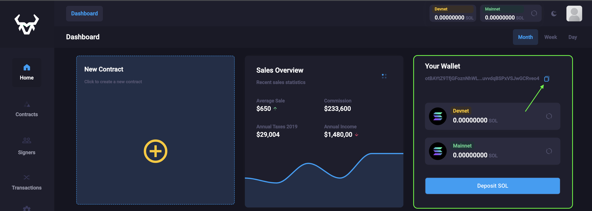
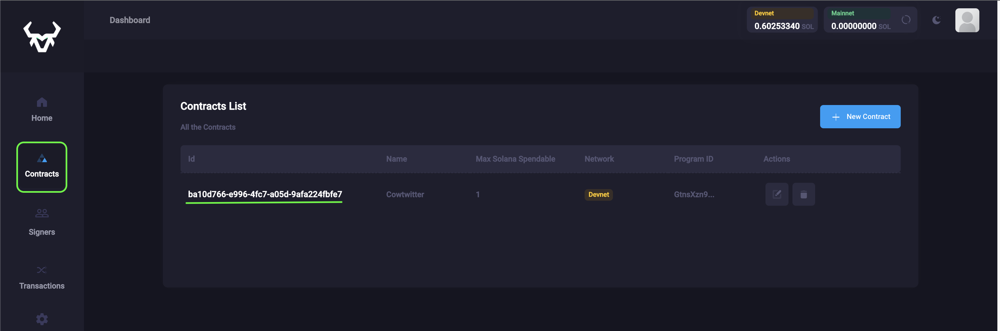

# Quick Start

## Just pay the fees
### 1. Install Cowsigner:
```bash
npm install cowsigner
```

### 2. Convert your RPC function in a method:
From this:

```ts
await program.value.rpc.updateTweet(topic, content, {
   accounts: {
       author: wallet.value.publicKey,
       tweet: tweet.publicKey,
  },
})
```
To this:
```ts
program.value.methods.updateTweet(topic, content, {
   accounts: {
       author: wallet.value.publicKey,
       tweet: tweet.publicKey,
  },
})
```

### 3. Get your App Wallet Key from the Dashboard:
[Go to the dashboard](https://app.cowsigner.com/dashboard)



### 4. Get your Contract ID from the contract list:
[Go to the contact list](https://app.cowsigner.com/contracts/contract-list)



### 5. Import cowsigner
``` ts
import cowsigner from "cowsigner";
```

### 6. Call the `sendInstruction()` function:

Inject the method you extracted before in a variable called `method`
Then call the `sendInstruction()` with the `method`, the `contractId` and the `appWallet`

``` ts
let method = program.value.methods.updateTweet(topic, content, {
    accounts: {
        author: wallet.value.publicKey,
        tweet: tweet.publicKey,
    },
})

const contractId = '*********** YOUR_CONTRACT_ID ***********'
let appWallet = new PublicKey('*********** YOUR_PUBLIC_KEY ***********');

await cowsigner.sendInstruction(method, appWallet, contractId)
```