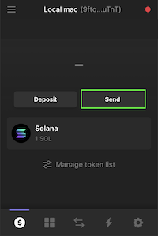
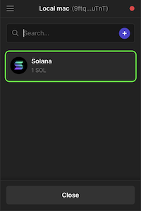
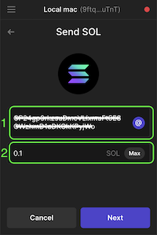
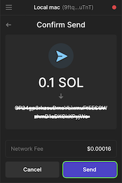
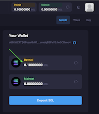

# Deposit Solana

### 1. Get your App Wallet Key from the Dashboard:
[Go to the dashboard](https://app.cowsigner.com/dashboard)

### 2. Open your favourite wallet (In this case I use Phantom)
[Download it here if you want](https://phantom.app/download)

### 3. Select Solana SOL

### 4. Enter the Public Key and the Solana amount
1. Enter the public key you copied before
2. Enter the amount of Solana that you want to transfer

### 5. Confirm the transfer

### 6. Wait 5 to 10 seconds and you'll see the import transferred on your Cowsigner Wallet
